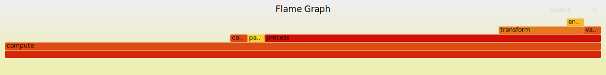
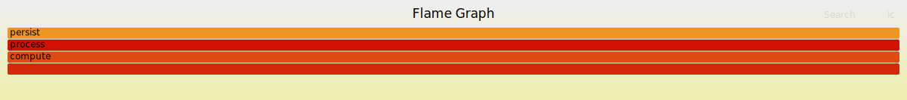
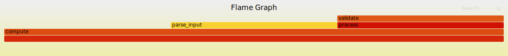

# Profiling Example

Demonstrates the CDK's built-in profiling support for measuring instruction
costs, heap memory growth, stable memory growth, and generating flamegraphs.

## How it works

Set `pub const cdk_profiling = true;` in your canister source. The CDK
automatically instruments all exported entry points (`init`, `query`,
`update`, etc.) and exposes profiling endpoints:

| Endpoint               | Type   | Description                          |
|------------------------|--------|--------------------------------------|
| `__get_cycles`         | query  | Current instruction counter          |
| `__get_profiling`      | query  | Paginated trace data                 |
| `__get_profiling_names`| query  | Function ID to name mapping          |
| `__toggle_tracing`     | update | Enable/disable trace recording       |
| `__toggle_entry`       | update | Clear trace buffer on each call      |

No manual wrapping is needed. When `cdk_profiling` is absent or `false`,
there is zero overhead -- the instrumentation is eliminated at comptime.

Each trace entry records three metrics at every function entry/exit point:

- **Instructions** -- CPU instruction count via `performance_counter`
- **Heap pages** -- WASM linear memory size via `memory.size`
- **Stable pages** -- IC stable memory size via `stable64_size`

## Generating flamegraphs

In your PocketIC test, fetch the trace and select a metric:

```zig
const pic = @import("pocket-ic");

// ... deploy canister, enable tracing, call methods ...

// Instruction cost flamegraph
var trace = try pic.flamegraph.fetch(allocator, &pocket, cid, .instructions);
defer trace.deinit();
try trace.writeFoldedStacks("profile.folded");

// Stable memory growth flamegraph
var stable = try pic.flamegraph.fetch(allocator, &pocket, cid, .stable_pages);
defer stable.deinit();
try stable.writeFoldedStacks("stable.folded");

// Heap memory growth flamegraph
var heap = try pic.flamegraph.fetch(allocator, &pocket, cid, .heap_pages);
defer heap.deinit();
try heap.writeFoldedStacks("heap.folded");
```

Then render the SVGs:

```
flamegraph.pl profile.folded > profile.svg
flamegraph.pl stable.folded > stable.svg
flamegraph.pl heap.folded > heap.svg
```

## Running the example

```
zig build test        # run tests and produce .folded files
zig build flamegraph  # run tests + render all SVGs
```

## Example output

Instructions:



Stable memory:



Heap memory:



## Manual instrumentation

For sub-function granularity, use `enter` / `exit`:

```zig
fn myFunction() void {
    cdk.profiling.enter("my_function");
    defer cdk.profiling.exit("my_function");

    // ... work ...

    // Inline sections work too:
    cdk.profiling.enter("subsection");
    // ... more work ...
    cdk.profiling.exit("subsection");
}
```
